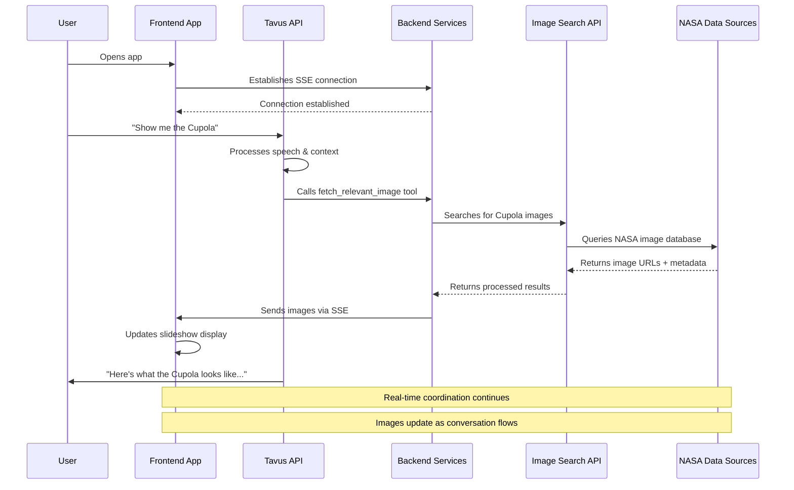

# 🚀 ISS Image Search API

A Flask-based RAG (Retrieval-Augmented Generation) search API for NASA's International Space Station images using FAISS vector indexing and sentence transformers.

## 📁 Project Structure

```
nasa-space-apps-challenge-2025/
├── main.py                     # Main API entry point
├── start.py                    # Startup script for API + Web
├── config.py                   # Configuration settings
├── requirements.txt            # Python dependencies
├── README.md                   # This file
│
├── src/                        # Source code
│   ├── api/                    # API modules
│   │   ├── __init__.py
│   │   └── app.py             # Main Flask application
│   │
│   ├── search/                 # Search engine
│   │   ├── __init__.py
│   │   └── engine.py          # FAISS search engine
│   │
│   ├── web/                    # Web interface
│   │   ├── __init__.py
│   │   ├── app.py             # Web Flask app
│   │   └── templates/         # HTML templates
│   │       ├── base.html
│   │       └── index.html
│   │
│   ├── data/                   # Data files
│   │   ├── iss_images_organized.json
│   │   ├── cupola_images.json
│   │   └── nbl_images_mass.json
│   │
│   └── utils/                  # Utility scripts
│       ├── __init__.py
│       ├── download_images.py
│       ├── mass_nbl_fetcher.py
│       └── select_iss_images.py
│
├── scripts/                    # Utility scripts
│   ├── start_api.py
│   ├── demo_search.py
│   ├── example_usage.py
│   └── test_*.py
│
├── static/                     # Static web assets
│   ├── css/
│   ├── js/
│   └── images/
│
├── docs/                       # Documentation
├── tests/                      # Test files
└── images/                     # Downloaded images
    ├── cupola/
    └── nbl/
```

## 🚀 Quick Start

### 1. Install Dependencies

```bash
pip install -r requirements.txt
```

### 2. Start the API

```bash
# Start API only
python main.py

# Start API + Web Interface
python start.py
```

### 3. Access the Application

- **API**: http://localhost:5001
- **Web Interface**: http://localhost:8080

## 🔧 Configuration

Edit `config.py` to customize settings:

```python
# API Configuration
API_HOST = '0.0.0.0'
API_PORT = 5001
API_DEBUG = False

# Data Configuration
DATA_FILE = 'src/data/iss_images_organized.json'

# Search Configuration
DEFAULT_TOP_K = 5
MAX_TOP_K = 20
MODEL_NAME = 'all-MiniLM-L6-v2'
```

## 📚 API Endpoints

### Search Images
- **POST** `/search` - Search with JSON payload
- **GET** `/search?q=query&top_k=5` - Search with URL parameters

### Image Management
- **GET** `/images/{nasa_id}` - Get specific image by NASA ID
- **GET** `/categories` - Get available categories
- **GET** `/stats` - Get search engine statistics

### Health Check
- **GET** `/health` - API health status

## 🧪 Usage Examples

### Python Client

```python
import requests

# Search for images
response = requests.post('http://localhost:5001/search', json={
    'query': 'astronauts in cupola viewing earth',
    'top_k': 5
})

results = response.json()
for image in results['results']:
    print(f"Image: {image['image_url']}")
    print(f"Description: {image['description']}")
    print(f"Similarity: {image['similarity_score']:.3f}")
```

### cURL Examples

```bash
# Search for images
curl -X POST http://localhost:5001/search \
  -H "Content-Type: application/json" \
  -d '{"query": "astronauts in cupola viewing earth", "top_k": 5}'

# Health check
curl http://localhost:5001/health
```

## 🎯 Features

- **🔍 Natural Language Search**: Search images using natural language queries
- **🚀 FAISS Vector Indexing**: Fast similarity search using Facebook's FAISS library
- **🧠 Sentence Transformers**: Semantic understanding using pre-trained models
- **🌐 RESTful API**: Clean REST endpoints for easy integration
- **🎨 Web Interface**: Beautiful web UI for testing and demonstration
- **📊 Filtering & Categories**: Filter by category, source, and other metadata
- **⚡ Fast & Local**: All processing happens locally, no external API calls
- **🤖 Tavus Integration**: Real-time conversational AI with dynamic image display
- **📡 Real-time Updates**: Server-Sent Events for instant slideshow updates

## 🏗️ System Architecture

### Block Diagram

```
┌─────────────────────────────────────────────────────────────┐
│                    NASA Space Apps Challenge App            │
├─────────────────────────────┬───────────────────────────────┤
│        LEFT PANEL           │        RIGHT PANEL            │
│     Tavus Video Call        │     Dynamic Slideshow         │
│                             │                               │
│  ┌─────────────────────┐   │  ┌─────────────────────────┐  │
│  │                     │   │  │                         │  │
│  │   AI Astronaut      │   │  │    Current Image        │  │
│  │   (Video Stream)    │   │  │                         │  │
│  │                     │   │  │                         │  │
│  └─────────────────────┘   │  └─────────────────────────┘  │
│                             │                               │
│  ┌─────────────────────┐   │  ┌─────────────────────────┐  │
│  │   User Video        │   │  │    Image Gallery        │  │
│  │   (Webcam)          │   │  │    (Thumbnails)         │  │
│  └─────────────────────┘   │  └─────────────────────────┘  │
└─────────────────────────────┴───────────────────────────────┘
                                │
                                ▼
┌─────────────────────────────────────────────────────────────┐
│                    Backend Services                         │
├─────────────────────┬─────────────────────┬─────────────────┤
│   Tavus API         │   Image Search API  │   SSE Server    │
│   (Conversation)    │   (FAISS + RAG)     │   (Real-time)   │
└─────────────────────┴─────────────────────┴─────────────────┘
                                │
                                ▼
┌─────────────────────────────────────────────────────────────┐
│                    Data Sources                             │
├─────────────────────┬─────────────────────┬─────────────────┤
│   NASA Image API    │   ISS Database      │   NBL Images    │
│   (Cupola Photos)   │   (Organized Data)  │   (Training)    │
└─────────────────────┴─────────────────────┴─────────────────┘
```

### Sequence Diagram



## 🔄 Real-time Communication Flow

### Server-Sent Events (SSE) Implementation

**1. Connection Establishment**
```javascript
// Frontend opens persistent connection
const eventSource = new EventSource('/api/slideshow-stream/ABC123');
```

**2. Tool Call Processing**
```javascript
// Tavus calls backend tool
app.post('/api/fetch-image', async (req, res) => {
  const { conversation_id, topic, location } = req.body;
  
  // Fetch images from search API
  const images = await searchNASAImages({ topic, location });
  
  // Send to frontend via SSE
  const connection = connections.get(conversation_id);
  if (connection) {
    connection.write(`data: ${JSON.stringify({
      type: 'UPDATE_SLIDESHOW',
      images: images
    })}\n\n`);
  }
  
  res.json({ success: true });
});
```

**3. Frontend Updates**
```javascript
// Frontend receives and processes updates
eventSource.onmessage = (event) => {
  const data = JSON.parse(event.data);
  if (data.type === 'UPDATE_SLIDESHOW') {
    slideshow.updateImages(data.images);
  }
};
```

## 🛠️ Development

### Running Tests

```bash
# Run all tests
pytest

# Run specific test file
pytest tests/test_api.py
```

### Adding New Images

1. Add images to `src/data/` directory
2. Update the data loading logic in `src/search/engine.py`
3. Restart the API

### Customizing Search

Edit `src/search/engine.py` to modify:
- Search algorithm
- Similarity scoring
- Result formatting

## 📦 Deployment

### Production Deployment

```bash
# Using Gunicorn
gunicorn -w 4 -b 0.0.0.0:5001 main:app

# Using Docker (create Dockerfile)
docker build -t iss-search-api .
docker run -p 5001:5001 iss-search-api
```

### Environment Variables

```bash
export API_HOST=0.0.0.0
export API_PORT=5001
export DATA_FILE=src/data/iss_images_organized.json
export LOG_LEVEL=INFO
```

## 🤝 Contributing

1. Fork the repository
2. Create a feature branch
3. Make your changes
4. Add tests
5. Submit a pull request

## 📄 License

This project is part of the NASA Space Apps Challenge 2025.

## 🙏 Acknowledgments

- NASA for providing the amazing ISS images
- Facebook AI Research for FAISS
- Hugging Face for Sentence Transformers
- The open-source community for all the amazing tools

---

**Built for NASA Space Apps Challenge 2025 - ISS 25th Anniversary Apps** 🚀
# nasa-space-apps-challenge-2025

- Identify available data sources
- Narrow down the data sources
    - Needs to be relevant to the challenge (sight and weightlessness):
        - Cuploa Images
        - Neutral Buoyancy Laboratory (NBL) 
- Scrape and store OR point to relevant data sources

Check Tavus API
- Check what APIs are available 
- Wire Tavus to pull data from the relevant narrowed down sources 
- Check if Tavus can dynamically pull in the relevant data like images as the user asks for questions
- Needs to be able to inform users how these unique experiences benefit humans on Earth

7-slide presentation
- Use Gamma

30-seconds video presentation
- Record convo with Tavus

5-mins pitch + 2-mins Q&A